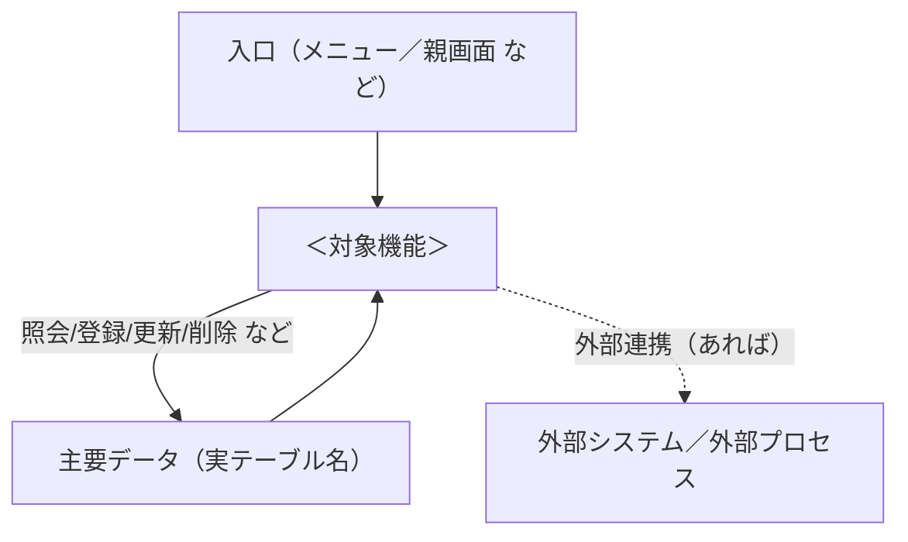
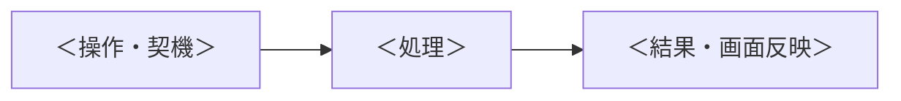
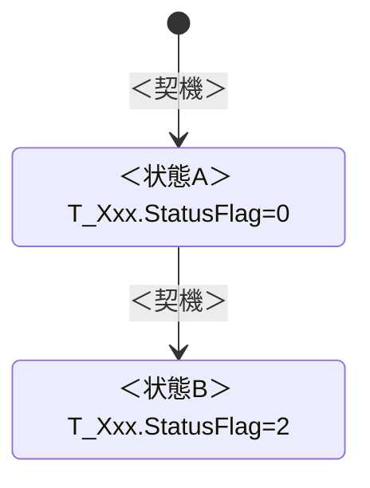
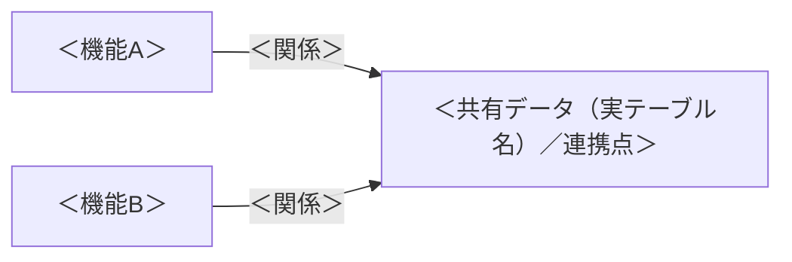

# 機能概要：<対象名>

<!-- ガイド（この型について）:
 この「概要編」は詳細設計書から派生する“速く読んで機能と流れを掴む”ための短い文書。
 - 詳細設計書を唯一の入力源とし、そこに無い事実を足さない（コードは見ない・下流専用）。
 - 図（mermaid）を主、叙事を従。流れを全部列挙しない——主幹に絞り、残りは一覧で触れるに留める。
 - 各節は派生元（詳細設計書の §）を括弧で示し追跡可能にする。
 - 言語は既定で詳細設計書に合わせる（lang パラメタで切替）。
 - 章立て・見出しは変えない。該当しない節（状態遷移なし・単一機能で機能間関係なし 等）は
   「該当なし」と明記するか、単一機能では §9 を削除する。

 ★フィールドは必ずテーブル名／クラス名を冠する（例: T_ReportHistory.StatusFlag、
   ReportModel.PatientId）。裸のカラム名（StatusFlag だけ）は書かない——どの表/クラスの
   ものか一目で分かるようにする。図・表・本文いずれでも同じ。
 ★概要でもデータは薄く流さない。重要ノード（生成・変換・保存・状態変化・外部送信）で
   「何のデータが・どう動き・どのキー/フラグが意味を持つか」を説明する（§6）。ただし
   全列ダンプ・SQL 本文は概要に持ち込まない（それは詳細設計書へ誘導）。
 ★データ/ファイルの“物理的な保存方式・保存先”は必ず書く（§7）。DB内(BLOB/Base64)か
   ファイルパスか、保存先（ローカル一時／ネットワーク共有／レジストリ）、格納方式を
   切り替えるフラグ、一時ファイルの生成・削除まで。ここは省略しない。 -->

| 項目 | 内容 |
|---|---|
| 対象機能 | <対象名（単一）／複数機能の総称（総合モード）> |
| 派生元（詳細設計書） | <パス。単一 md ／ 00_index を含む分割 md 群> |
| 生成日 | |

## 1. 一言サマリ

<!-- この機能は何をするか。1〜2文。専門用語は避け、業務の言葉で。← 詳細 §1.1 目的 / §1.2 スコープ -->

## 2. 全体像

<!-- 入口（誰が呼ぶか）→ 本機能 → データ／外部連携 の関係を1枚の図で。
     ← 詳細 §2.1 呼出元 / §2.2 遷移先 / §6 主要テーブル / §7 外部連携。
     ノード名は詳細設計書に実在する名前を使う（創作しない）。テーブルは実テーブル名で。 -->

## 3. 主要な使い方・モード

<!-- 利用者が実際に何をするか。モード/形態（新規/編集/参照、通常/特殊 等）があれば小表で。
     ← 詳細 §1.2 スコープ / §3.5 条件付き表示制御 / §5.3。無ければ使い方を数行で。 -->

| モード／形態 | いつ | 何をする |
|---|---|---|
| | | |

## 4. 主要な流れ

<!-- 主幹の処理フローだけを図に（目安 ≲6 本）。多いときは主幹だけ図にし、残りは §4.2 に1行ずつ。
     ← 詳細 §5.1 処理一覧 / §5.2 処理詳細。無理に全部を図にしない（速読が目的）。
     図のステップに「そこで動くデータ」を一言添えるとよい（詳細は §6 で）。 -->

### 4.1 ＜主フロー名＞

### 4.2 その他の処理（一覧）

<!-- 図にしない残りの処理を1行ずつ。詳細は詳細設計書へ誘導する。← 詳細 §5.1 -->

| 処理 | 概要 | 詳細（詳細設計書の該当箇所） |
|---|---|---|
| | | |

## 5. 状態の遷移

<!-- 状態を持つ機能のみ（作成→更新→削除→復元、下書き→確定→取消 等）。
     無ければ「該当なし（状態を持たない）」。← 詳細 §5.3 状態遷移。
     状態を表すフィールドはテーブル名を冠して書く（例: T_Xxx.StatusFlag=0/2/8）。 -->

## 6. データの流れと重要ノードでの説明

<!-- 概要でもデータは薄く流さない。何を照会/登録/更新/削除するかに加え、
     「重要ノード（生成・変換・保存・状態変化・外部送信・マージ 等）で、何のデータが
      どう動き、どのキー/フラグが意味を持つか」を業務語で説明する。
     ★フィールドは必ずテーブル名/クラス名を冠する（T_Xxx.列）。
     ★ただし全列ダンプ・SQL 本文は書かない（詳細設計書 §6 へ誘導）。
     ← 詳細 §6 ユースケース / §6.3 UC→CRUD / §5.3 状態遷移。 -->

### 6.1 データの出入り（要約）

| 何をする（業務動詞） | 対象データ（実テーブル名） | 種別（照会/登録/更新/削除） | 効くキー／フラグ（テーブル名付き） |
|---|---|---|---|
| | | | |

### 6.2 重要ノードでのデータの動き

<!-- 上のフロー（§4）や状態遷移（§5）の“ここが要”という節目を数点選び、そこで起きる
     データの動きを1〜数文で説明する。例:「生成時: 元の T_Templete.SaveFile を複製して
     T_History に1行 INSERT。T_History.StatusFlag=0（有効）で入り、キーは T_History.HistoryId。」
     「更新時: 旧 T_History 行を StatusFlag=8（旧版）にし、新版を StatusFlag=0 で INSERT（版管理）。」
     重要なキー・フラグ・親子関係（どの ID でどの表とつながるか）を必ずテーブル名付きで。 -->

- **＜ノード名（例: 生成）＞**: ＜何のデータが・どう動くか。効くキー/フラグをテーブル名付きで＞
- **＜ノード名（例: 更新／削除／承認 等）＞**:
- **＜ノード名（例: 外部送信／マージ）＞**: ＜送信・反映される先、書き換わるキー＞

## 7. データ・ファイルの保存方式／保存先

<!-- ★この節は省略しない。データやファイルが“物理的にどこへ・どう”保存されるかを書く。
     観点（該当するものを）:
     - DB 内格納か、ファイルパス格納か（例: 原本を Base64 で T_Xxx.SaveFile(nvarchar max) に格納／
       OutPutFile にファイルパスを格納）。切り替えるフラグ（例: T_Xxx.ConvertFlag=0:DB格納/1:パス）。
     - 保存先（ローカル一時フォルダ／ネットワーク共有パス／レジストリ 等）と、その決定条件（設定・施設）。
     - 一時ファイルの生成と削除タイミング（誰がいつ消すか）。
     - 保存されるファイルの形式・拡張子（例: xls/xlsx を決める T_Xxx.ExtensionType）。
     フィールドは必ずテーブル名付き。← 詳細 §6.4 SQL / §6.5 テーブル / §7 外部連携（保存・ファイル）。
     該当が無ければ「該当なし（確認済み: …）」。 -->

| 何を保存 | 保存方式（DB格納/ファイルパス 等・格納先フィールド） | 保存先・場所 | 切替条件（フラグ/設定） | 一時ファイルの扱い |
|---|---|---|---|---|
| | | | | |

## 8. 用語・主要データ・キー設定（速查表）

<!-- 読み手が知っておくと理解が早まる最小限だけ。挙動を変える設定に絞る。
     テーブル/フィールドはテーブル名付きで。← 詳細 §1.4 用語 / §6.5 テーブル / §8 設定 -->

| 名称 | 何か |
|---|---|
| | |

## 9. 機能間の関係（総合モードのみ）

<!-- 複数の機能を1つの概要にまとめるときだけ書く。各機能の関係（誰が造り誰が使うか、
     共有するデータ/連携点）を1枚の図で。単一機能ではこの節ごと削除する。
     共有するデータは実テーブル名で示す。← 各詳細設計書の §2.2 / 共通の 00_index。 -->

## 一言まとめ

<!-- 最後にもう一度1〜2文で「結局この機能（群）は何をするのか」。 -->
